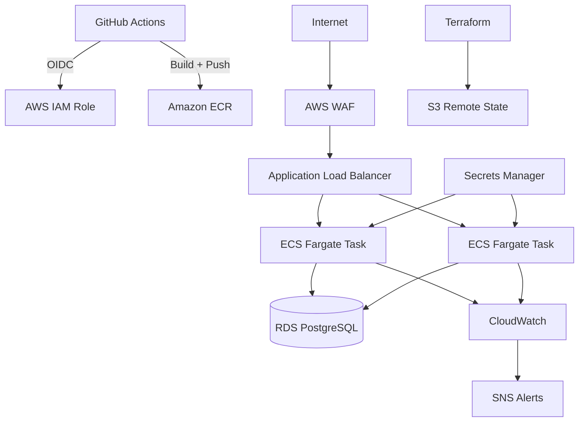

# CloudForge

CloudForge is a production-style AWS platform built with Terraform and a small ASP.NET Core API. The repository focuses on infrastructure design, secure deployment, networking, observability, and repeatable environment management.

## Architecture



## What it demonstrates

- Terraform modules and isolated dev/prod environments
- Custom VPC with public and private subnets across two availability zones
- NAT-based outbound access for private workloads
- ECS Fargate behind an Application Load Balancer
- RDS PostgreSQL in private subnets
- Secrets Manager for database credentials
- ECR image scanning and lifecycle management
- ECS target-tracking autoscaling
- CloudWatch dashboards and alarms with SNS notifications
- AWS WAF managed rules and rate limiting
- GitHub Actions with AWS OIDC and no long-lived AWS access keys
- S3 remote Terraform state with encryption, versioning, and native lockfiles
- Environment-specific production controls such as Multi-AZ RDS and deletion protection

## Repository layout

```text
.
├── app
│   ├── CloudForge.Api
│   └── Dockerfile
├── terraform
│   ├── bootstrap
│   │   └── state-backend
│   ├── environments
│   │   ├── dev
│   │   └── prod
│   └── modules
│       ├── ecr
│       ├── ecs
│       ├── github-oidc
│       ├── monitoring
│       ├── network
│       ├── rds
│       └── waf
├── scripts
│   └── smoke-test.sh
└── .github
    └── workflows
```

## Application

The application is intentionally small so the infrastructure remains the focus. It exposes a task API backed by PostgreSQL.

```text
GET    /
GET    /health
GET    /api/tasks
GET    /api/tasks/{id}
POST   /api/tasks
PUT    /api/tasks/{id}
DELETE /api/tasks/{id}
```

## Bootstrap

The bootstrap stack creates the S3 state bucket and the account-level GitHub OIDC identity provider.

```bash
cd terraform/bootstrap/state-backend
terraform init
terraform apply
terraform output
```

Save the `bucket_name` and `github_oidc_provider_arn` outputs.

## Configure an environment

Copy the example variables file.

```bash
cd terraform/environments/dev
cp dev.tfvars.example dev.tfvars
```

Set the bootstrap OIDC provider ARN and the GitHub owner/repository IDs in the tfvars file.

New GitHub repositories use immutable OIDC subjects, so the AWS trust policy uses both the account owner ID and repository ID.

Initialize the backend with the bucket created by the bootstrap stack.

```bash
terraform init \
  -backend-config="bucket=YOUR_STATE_BUCKET"

terraform plan -var-file=dev.tfvars
terraform apply -var-file=dev.tfvars
```

Repeat the same process under `terraform/environments/prod` for production.

## First container deployment

Terraform creates the ECR repository and ECS service. Build and push the initial image after the ECR repository exists.

```bash
aws ecr get-login-password --region us-east-1 | \
  docker login --username AWS --password-stdin ACCOUNT_ID.dkr.ecr.us-east-1.amazonaws.com

docker build -t cloudforge-dev app

docker tag cloudforge-dev:latest \
  ACCOUNT_ID.dkr.ecr.us-east-1.amazonaws.com/cloudforge-dev:latest

docker push ACCOUNT_ID.dkr.ecr.us-east-1.amazonaws.com/cloudforge-dev:latest

aws ecs update-service \
  --cluster cloudforge-dev \
  --service cloudforge-dev \
  --force-new-deployment
```

## GitHub Actions

`terraform-check.yml` runs formatting and validation for both environments on infrastructure pull requests.

`build.yml` restores and builds the .NET application on application changes.

`deploy.yml` uses GitHub OIDC to assume an AWS role, builds the Docker image, pushes both commit-specific and `latest` tags to ECR, then forces a new ECS deployment.

Create GitHub environments named `dev` and `prod`. Add an environment variable named `AWS_DEPLOY_ROLE_ARN` to each one using the `github_actions_role_arn` Terraform output from the matching environment.

## Security choices

- ECS tasks run in private subnets without public IP addresses.
- The database is private and encrypted at rest.
- Database passwords are generated by Terraform and stored in Secrets Manager.
- GitHub Actions uses temporary AWS credentials through OIDC.
- ECR scans images on push.
- WAF applies the AWS managed common rule set and an IP rate limit.
- Terraform state is encrypted, versioned, private, and locked through S3 lockfiles.

## Cost

This project creates billable AWS resources, especially NAT Gateways, RDS, Fargate, and the Application Load Balancer. The dev environment uses a single NAT Gateway and smaller compute settings to reduce cost. Destroy environments when they are not being used.

```bash
terraform destroy -var-file=dev.tfvars
```

Production enables two NAT Gateways, Multi-AZ RDS, two ECS tasks, and database deletion protection. Disable deletion protection before intentionally destroying production.

## Smoke test

```bash
./scripts/smoke-test.sh http://YOUR_ALB_DNS_NAME
```

## Stack

Terraform, AWS VPC, ECS Fargate, ECR, RDS PostgreSQL, Application Load Balancer, AWS WAF, Secrets Manager, CloudWatch, SNS, IAM, GitHub Actions, Docker, ASP.NET Core, Entity Framework Core, Npgsql.
